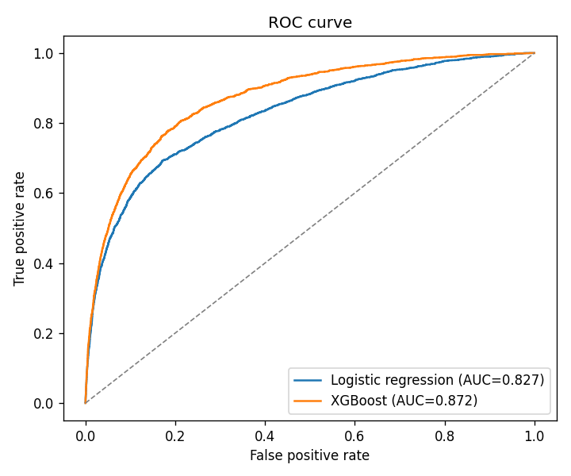
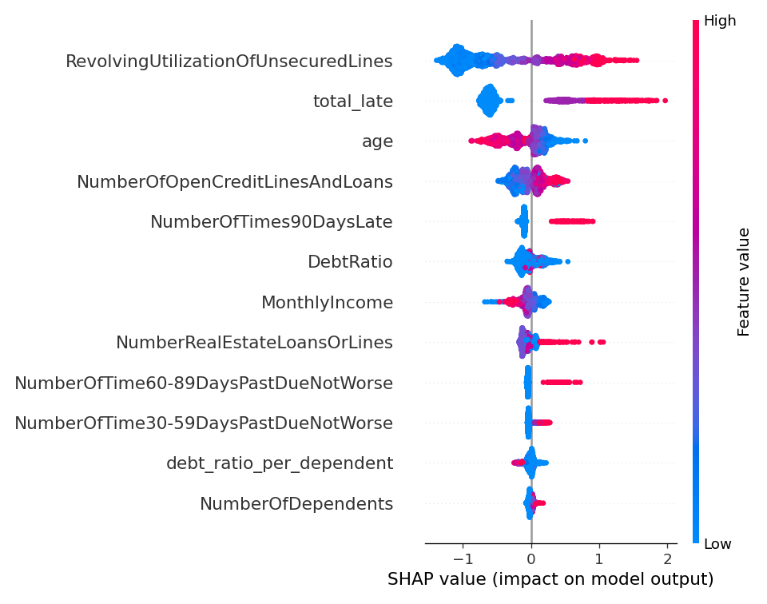
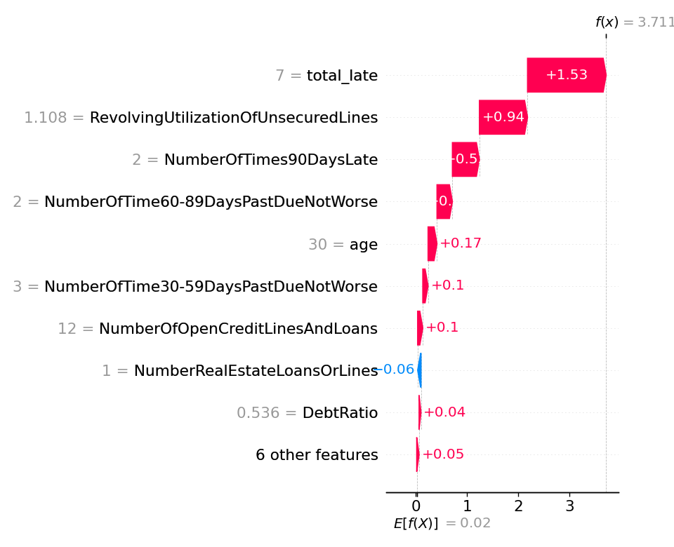
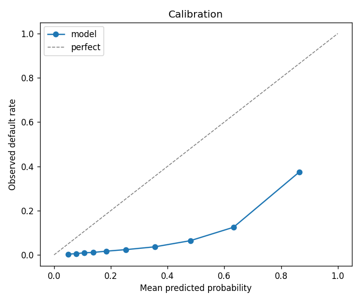

# Credit Scoring — Give Me Some Credit

> **Résumé (FR)** — Modèle de scoring crédit sur 150 000 clients bancaires : nettoyage sans fuite de données, régression logistique de référence puis XGBoost optimisé par validation croisée, explicabilité SHAP. Pipeline reproductible en une commande ; le modèle exporté est servi par le projet [credit-scoring-mlops](https://github.com/elgr3/credit-scoring-mlops).

## Problem
Predict whether a borrower will experience serious financial distress (90+ days past due) within the next two years.

## Data
[Give Me Some Credit](https://www.openml.org/d/46929) (OpenML 46929): 150,000 borrowers, 10 features, default rate **6.68 %**. Downloaded automatically on first run; not redistributed in this repo.

## Approach
1. **`CreditCleaner`** — a scikit-learn transformer fitted on the training set only, so no statistic leaks from the test set:
   - `MonthlyIncome` (19.8 % missing) imputed with the train median, plus a missing-value flag;
   - `NumberOfDependents` missing → 0, plus a flag;
   - implausible ages (< 18) replaced by the train median adult age;
   - late-payment counts of 96/98 are codes, not counts: flagged (`late_special_code`) and zeroed;
   - derived features: `total_late`, `debt_ratio_per_dependent`.
2. **Logistic regression** baseline (balanced class weights, standardised features).
3. **XGBoost** with `scale_pos_weight`, tuned by a 20-iteration randomized search with stratified 5-fold CV on AUC.
4. **SHAP** for global importance and a local explanation of the riskiest test borrower.

## Results (held-out test set, 30,000 borrowers)

| Model | AUC-ROC | Gini | KS | Brier |
|---|---|---|---|---|
| Logistic regression | 0.8274 | 0.6547 | 0.5214 | 0.1556 |
| **XGBoost** | **0.8717** | **0.7434** | **0.5940** | **0.1382** |

Best XGBoost parameters: 753 trees, max depth 5, learning rate 0.0113, subsample 0.78, column sample 0.70, min child weight 15.

Top drivers (mean |SHAP|): `RevolvingUtilizationOfUnsecuredLines`, `total_late`, `age`, `NumberOfOpenCreditLinesAndLoans`, `NumberOfTimes90DaysLate`.






## Limitations & next steps
- `scale_pos_weight` inflates predicted probabilities (see the calibration plot): use the score for ranking, or recalibrate (isotonic / Platt) before reading it as a probability of default.
- No out-of-time validation: the dataset has no dates.
- No fairness analysis (e.g. by age band) yet.

## How to run
```bash
python -m venv .venv
.venv/Scripts/activate          # Linux/macOS: source .venv/bin/activate
pip install -r requirements-dev.txt
python run.py                   # ~15 min on CPU: writes reports/ and models/
pytest
```

## Project structure
```
src/credit_scoring/   config · data · features (CreditCleaner) · train · evaluate · explain · export
notebooks/01-eda.ipynb   exploratory analysis motivating each cleaning rule
reports/              metrics.json + figures (generated by run.py)
tests/                fast unit tests on synthetic data (run in CI)
run.py                full pipeline
```
